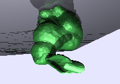
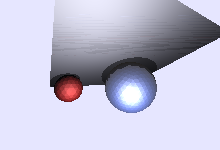

# pyRayTRender

[](LICENSE)
[](pyproject.toml)

> ⚠️ **Work in progress.** This is a hobby/research-grade reference
> implementation of a ray tracer, correctness-checked against its own test
> suite and example renders, but **not** independently reviewed or
> production-hardened. See [Disclaimer & TODO](#disclaimer--work-in-progress)
> before relying on it.

A small, **fully Python-native** ray-tracing rendering engine for simple
triangular-mesh scenes. Every operation — camera ray generation, ray/triangle
intersection, shadowing, and reflections — is implemented with vectorised
NumPy; there is **no compiled/native backend and no proprietary dependency**,
so it runs unmodified on any CPU-based machine (Linux, macOS, Windows).




*Both figures are generated end-to-end by the real renderer — see
[`docs/generate_figures.py`](docs/generate_figures.py).*

---

## Features

- **Camera** (pin-hole model): resolution, 3D position/orientation, focal
  length (zoom), pan/rotate/orbit, target-lock and screen-orientation-lock.
- **Light** (single point light source): position, ambient/diffuse/specular
  colour, intensity, hard/soft shadows.
- **Geometry** (any number of raster triangular meshes): load from `.obj`/
  `.stl`, or generate primitives from scratch (`genPlane`, `genTriangle`,
  `genCircle`, `genIcoSphere`), rigid transforms, uniform/anisotropic scaling,
  mesh subdivision and decimation, face/vertex normals, `.obj` export.
- **Material** (Blinn-Phong model): ambient, diffuse, specular colour,
  shininess, reflection coefficient, transparency, recursive reflection depth.
- **Renderer**: primary ray casting, hard shadows, recursive mirror
  reflections, Blinn-Phong shading, sky colour, optional AR-style alpha mask,
  single-frame (`shoot`) and live-preview (`stream`) output.

The Stanford Bunny (`assets/Bunny.obj`/`.stl`, public-domain test mesh) is
included for convenience; everything else can be generated procedurally with
the `Geometry` primitive generators.

---

## Install

```bash
python3 -m pip install -r requirements.txt
# or, as an editable package:
python3 -m pip install -e .
```

Dependencies: `numpy`, `matplotlib`, `pillow`, `stl_reader` (binary STL
loader). All are plain-Python/PyPI packages — nothing to compile.

## Quick start

```python
from pyraytrender import Camera, Geometry, Light, Renderer

sphere = Geometry(label='Sphere')
sphere.genIcoSphere(c3=[0, 0, 0], rad=1.0, nsub=3)
sphere.mat.dffRGB = [0.2, 0.4, 0.9]
sphere.mat.rflC = 0.3          # reflection coefficient
sphere.mat._iniMat()

floor = Geometry(label='Floor')
floor.genPlane()
floor.scale(20.0)
floor.tformRigid(0, 0, 0, -10, -10, -1)

camera = Camera(w=200, h=140, eye=[3, -4, 2], trg=[0, 0, 0])
light = Light(ctr=[3, -3, 4])

renderer = Renderer(cam=camera, geo=(sphere, floor), lgt=light,
                     shadowsFlag=True, reflectionsFlag=True)
renderer.shoot(frmFileName='render.png')
```

See [`examples/`](examples/) for complete, runnable scripts:

| Script | Demonstrates |
|---|---|
| `render_bunny.py` | Loading the Stanford Bunny mesh, shadows + reflections |
| `render_primitives.py` | Procedurally-generated icospheres, shadows + reflections |
| `demo_camera_motion.py` | Camera orbit around a target |
| `demo_light_motion.py` | Moving light source |
| `demo_geometry_motion.py` | Moving/rotating geometry |
| `demo_multiple_geometry.py` | Multiple objects incl. a mirror plane and a sky dome |
| `demo_multiple_lights.py` | Combining several point lights |

```bash
python3 examples/render_bunny.py
```

## Tests

```bash
python3 -m pip install -e ".[test]"
python3 -m pytest tests/ -v
```

Covers the core math utilities, geometry primitives, camera motion
invariants, and an end-to-end render smoke test.

---

## Performance notes

This engine deliberately favours **simplicity and portability** over speed:
every stage is vectorised with NumPy broadcasting across *all* rays and *all*
triangles at once — no BVH/acceleration structure, no tiling, no
multiprocessing. This makes it dependency-free and easy to read, but it also
means:

- Memory scales with `pixels × triangles` (per bounce); high resolutions or
  dense meshes can use a lot of RAM (a 320×224 render of the ~5k-face Bunny
  with shadows + reflections consumed tens of GB in testing). Prefer small
  resolutions (a few hundred pixels wide) or use the `dwnSmpl` parameter to
  subsample rays.
- There is no spatial acceleration structure, so runtime grows with mesh
  complexity; it is best suited to simple scenes (hundreds to a few thousand
  triangles), not production-scale assets.

## License

**CC BY-NC 4.0** — free for research, personal, and non-commercial use;
commercial use requires a separate license from the author. See
[`LICENSE`](LICENSE).

---

## Disclaimer & Work-In-Progress

This project is a **hobby/research-grade reference implementation**, not a
production renderer. It has been exercised via its own unit/smoke tests and
the example scripts above, but has **not** undergone independent third-party
review, fuzz-testing, or large-scale production use. Use at your own risk;
issues and pull requests are welcome.

### To-do / known limitations

- [ ] No spatial acceleration structure (BVH/kd-tree) — runtime and memory
      scale with `pixels × triangles`, see [Performance notes](#performance-notes).
- [ ] Only a single point light source is supported per scene at the API
      level (soft-shadow area lights are not implemented).
- [ ] Some grazing-angle floor/reflection renders show minor shading
      artefacts (a long-standing, not-yet-root-caused numerical edge case).
- [ ] Animation/keyframing is a placeholder (per-frame scripting only, no
      built-in keyframe interpolation).
- [ ] No packaged releases (PyPI wheel, versioned GitHub Releases) yet.

Contributions and bug reports that help close these gaps are very welcome.
